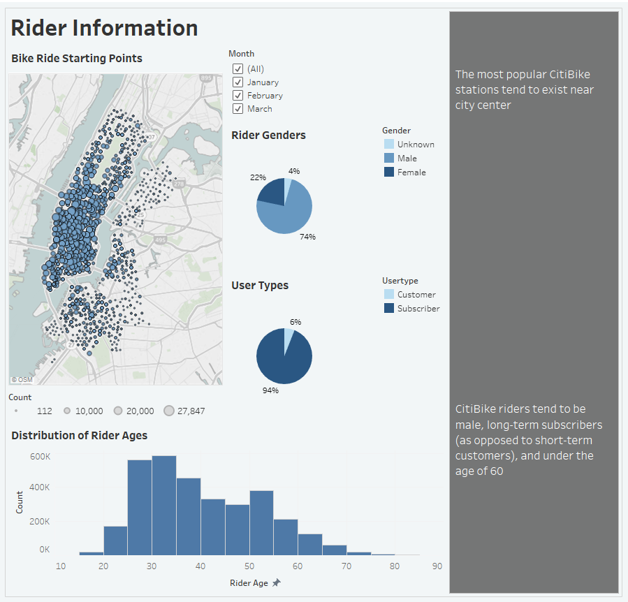
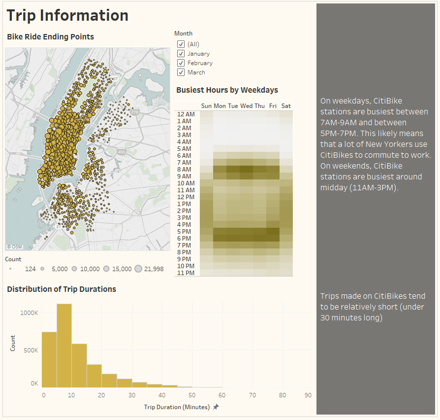
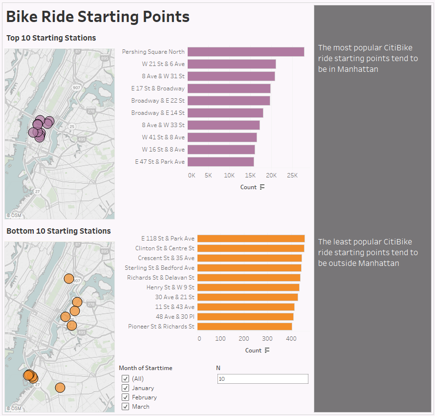
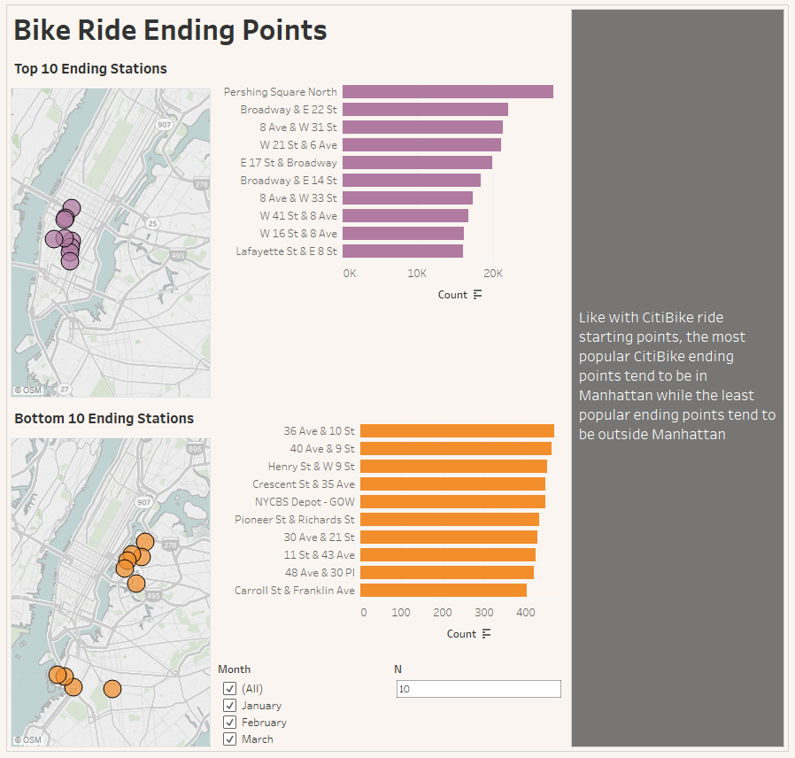
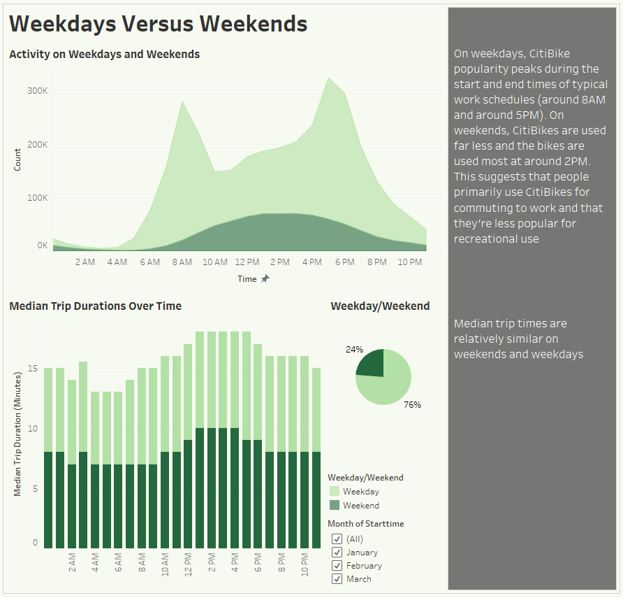

# CitiBike Tableau Dashboard
* A homework assignment for UC Berkeley's Data Analytics Bootcamp
* Project uses Tableau to create an interactive dashboard of CitiBike data in New York City
* Raw data is downloaded from the [CitiBike website](https://www.citibikenyc.com/system-data)
## Final Product
* See the final dashboard on this website: https://public.tableau.com/profile/miles.lucey#!/vizhome/citi_bike_dashboard/CitiBikeStory?publish=yes

